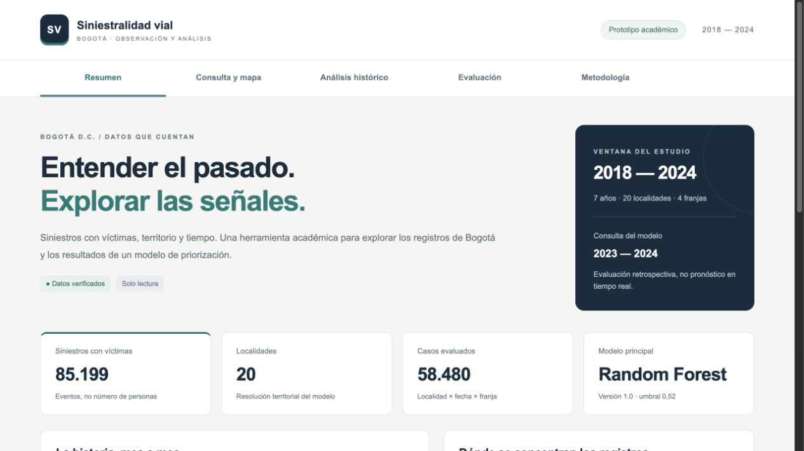

# Entrega del dashboard local — 1 de octubre de 2026

## Alcance implementado

Aplicación Python Dash con cinco secciones: resumen, consulta y mapa de las 20
localidades, análisis histórico, evaluación y metodología. Consulta retrospectiva
de 2023–2024 y descripción de siniestros con víctimas de 2018–2024. Filtros
combinables, figuras interactivas y exportaciones JSON/CSV con contexto. La
evaluación incorpora comparación global de detección por localidad y franja,
con tablas desplegables de positivos detectados, omitidos y falsas alertas.

El modelo principal sigue siendo `rf_victimas_bogota_v1.0`, umbral 0,52. No se
reentrenó, no se cambió la etiqueta ni se sobrescribieron resultados oficiales.
El score se presenta como puntuación, no como probabilidad calibrada. La maqueta
estática anterior permanece intacta en `dashboard/dist/`.

## Evidencia de verificación

- 54 pruebas unitarias: 15 nuevas del dashboard y 39 existentes.
- Integración completa inicial: `validacion_20261001.json`; cierre con comparación
  territorial: `validacion_final_20261001.json`.
- Verificación final del dashboard: `verificacion_final_20261001.json`.
- Las métricas globales coinciden con 05B para 58.480 decisiones; los conteos por
  actor y localidad coinciden con el EDA. Las 12 evidencias registradas permanecen
  intactas. Reconstrucción exacta del dataset comprobada por la integración.
- Revisión real en navegador de las cinco secciones: consulta de Kennedy y
  Sumapaz; filtro peatón con 20.933 siniestros históricos y 2.985 en 2024;
  evaluación global y Candelaria; lectura de metodología y trazabilidad.
- Pantallas de escritorio y móvil (390 px), sin desbordamiento horizontal del
  documento. La navegación usa controles accesibles por teclado; las tablas y
  la barra de navegación móvil permiten desplazamiento interno.
- Los cuatro generadores de descarga se verificaron mediante callbacks. El
  intento de capturar el archivo descargado mediante el navegador automatizado
  agotó su tiempo de espera: no se declara verificado el guardado extremo a
  extremo en ese navegador.
- Los tiempos medidos de cálculo de vistas fueron inferiores a cinco segundos
  localmente. No incluyen el navegador, arranque ni latencia de red y no son una
  garantía de rendimiento en un servidor público.

## Ejecución y pendientes

Iniciar desde la raíz con `python -m dashboard.app` y abrir
<http://127.0.0.1:8050>. Instalación, uso, interpretación, arquitectura y
diagnóstico en `dashboard/README.md`.

Esta entrega es un prototipo local funcional, no un servicio público terminado.
Quedan la aceptación por usuarios, comprobar descargas en su navegador habitual,
la decisión y configuración de alojamiento y la confirmación de condiciones de
reutilización de la fuente. No incluye validación prospectiva ni uso operativo.

